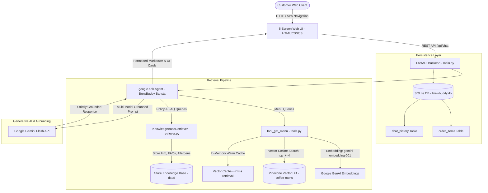

# ☕ BrewBuddy AI — Personalized Coffee Shop Assistant

> **"Your personal coffee expert."**
> 
> *Developed for Google Gen AI Academy APAC Cohort 3 Track 1*

BrewBuddy AI is a production-grade, full-stack AI coffee assistant application powered by the **Google Agent Development Kit (`google-adk` v2.8.0)**, **Google Gemini API**, **Pinecone Vector Database (`coffee-menu` index)**, and an interactive **5-Screen Single Page Application (SPA)** built to match Google Stitch Experience Design.

---

## 🏛️ System Architecture



---

## 🌲 Pinecone-Backed Vector RAG Flow

The menu retrieval pipeline replaces flat JSON/SQL lookups with true semantic vector search:

1. **Source of Truth**: [`data/menu.json`](file:///c:/Projects/Coffee%20agent/data/menu.json) remains the canonical, editable menu dataset with 15 coffee, cold beverage, tea, and bakery items.
2. **Dense Vector Embeddings**: Text representations (`f"{item['name']}: {item['description']}"`) are embedded into 768-dimensional vectors using `gemini-embedding-001` with `output_dimensionality=768`.
3. **Pinecone Serverless Index (`coffee-menu`)**: Vectors are stored in a serverless AWS Pinecone index with cosine similarity. Item metadata (`name`, `category`, `description`, `price`, `tags`, `allergens`, `calories`, `caffeine`, `temperature`) is stored alongside vectors for instantaneous lookup.
4. **Agent Retrieval Tool (`tool_get_menu`)**: The Barista Agent embeds incoming natural-language queries, searches `coffee-menu`, and filters by `SIMILARITY_SCORE_THRESHOLD >= 0.50`.
5. **Strict Grounding Rules**:
   - The agent only recommends items returned by `tool_get_menu()` for the current turn.
   - If the query is vague (e.g. *"surprise me"*), the agent asks a clarifying question instead of guessing.
   - Hard constraints (allergens, dairy-free, sugar-free, decaf) are strictly verified against returned `tags` and `allergens` fields.
   - For items not on the menu (e.g. bubble tea, sushi, pizza), the agent responds with: *"Sorry, that's not available on our menu right now."*

---

## 📋 Store Knowledge Base & Policy RAG

Store policies, customer FAQs, operational rules, and allergen safety are handled by a dedicated knowledge base pipeline:

- **Refund & Cancellation Policy**: Explains that prepared orders cannot be cancelled, and guarantees immediate counter replacement or a 100% refund credited within 24 hours.
- **BYO Cup & Sustainability**: Details the instant **₹15 discount** on any espresso, coffee, or cold beverage for customers bringing their own clean reusable mug, plus 100% biodegradable packaging.
- **Wi-Fi, Seating & Work Outlets**: Provides credentials (`BrewBuddy_Guest`, password: `brewbuddycoffee`), work tables with power outlets, and 2-hour peak seating limits.
- **Pet & Dog-Friendly Policy**: Clarifies outdoor garden and patio seating welcoming pets, with complimentary fresh water bowls.
- **Bulk & Corporate Catering**: Explains requirements (2 hours advance notice for >10 items) and the **10% discount** on catering orders exceeding ₹2,000.
- **Allergens & Dairy Alternatives**: Covers Oat Milk (+₹30) and Almond Milk (+₹30), vegan options (Veg Sandwich on sourdough), and shared espresso bar equipment cross-contamination notices.

---

## ⚡ Latency & Reliability Engineering

- **In-Memory Warm Vector Cache**: Pre-loads Pinecone index vectors directly into memory on FastAPI startup lifespan (`lifespan()`), delivering sub-millisecond retrieval times without network roundtrips.
- **Query Embedding Cache**: Employs `@lru_cache` for frequent search queries, eliminating repetitive embedding API calls.
- **Optimized Generation**: Configured with `thinking_budget=0` and constrained output tokens for snappy conversational streaming.
- **Resilient Multi-Model Fallback**: Automatically tries `gemini-flash-latest`, `gemini-3.5-flash`, and `gemini-2.5-flash`.
- **Grounded Offline Fallback**: In the event of network interruptions or Gemini API quota limits (429/503), the engine gracefully falls back to structured, local knowledge base responses without ever failing or dropping user requests.

---

## 🔄 How to Update the Menu & Re-Seed Pinecone

[`data/menu.json`](file:///c:/Projects/Coffee%20agent/data/menu.json) is the sole source of truth. To add, edit, or remove items:

1. Open and edit [`data/menu.json`](file:///c:/Projects/Coffee%20agent/data/menu.json).
2. Run the idempotent seeding script:
   ```powershell
   python seed.py
   ```
   *The script automatically generates embeddings, upserts updated items in a single batch, invalidates local cache, and syncs vectors with Pinecone.*

---

## 🌟 5-Screen Experience (Google Stitch Design)

- **🤖 AI Assistant Chat (`#page-assistant`)**: Conversational interface featuring embedded Generative UI product cards, live cart sidebar, and markdown formatting.
- **☕ Explore Menu Grid (`#page-menu`)**: Full scrolling gallery for all 15 coffee and bakery items with category filters (`Coffee`, `Cold Coffee`, `Tea`, `Snacks`) and real-time search.
- **🎛️ Personalization Studio (`#page-preferences`)**: Taste configurator for temperature (`Cold`, `Hot`), caffeine strength (`High`, `Medium`, `Low`), dietary preferences (`Vegan`, `Vegetarian`, `Keto`), and sweetness levels.
- **🧾 Order Status & Invoice (`#page-orders`)**: Real-time order preparation tracking progress bar and itemized receipt breakdown with 5% GST tax calculations.
- **❓ FAQ & Store Policies (`#page-faq`)**: Dedicated card hub for BYO Cup discounts, Wi-Fi credentials, refund policies, pet guidelines, catering, and allergens with instant "Ask AI Assistant" chips.

---

## 📂 Project Directory Structure

```text
Coffee agent/
├── backend/
│   ├── agent/
│   │   ├── agent.py              # google.adk.Agent, grounding loop & FAQ intents
│   │   └── tools.py              # tool_get_menu (Pinecone RAG) & order tools
│   ├── models/
│   │   └── schemas.py            # Pydantic v2 schemas
│   ├── rag/
│   │   ├── pinecone_client.py    # Pinecone singleton & warm vector cache
│   │   └── retriever.py          # Store knowledge & policy retriever
│   ├── services/
│   │   ├── db.py                 # SQLite database manager & chat history
│   │   ├── order_service.py      # Cart operations & 5% GST calculator
│   │   └── recommendation.py     # Preference matching engine
│   └── main.py                   # FastAPI server & static file host
├── data/
│   ├── menu.json                 # Canonical menu dataset (Source of Truth)
│   ├── store_info.txt            # Hours, location, Wi-Fi & policy guide
│   ├── faq.txt                   # BYO Cup, catering & refund FAQs
│   └── allergens.txt             # Allergen cross-contamination details
├── frontend/
│   ├── index.html                # 5-Screen SPA Tailwind markup
│   ├── app.js                    # SPA router, Marked.js & API client
│   └── styles.css                # Custom coffee theme styling
├── tests/
│   └── test_backend.py           # Automated test suite
├── seed.py                       # Pinecone index seeding & sync script
├── requirements.txt              # Project dependencies
├── .env.example                  # Environment variable template
├── .gitignore                    # Git ignore file
└── README.md                     # Documentation
```

---

## 🔑 Required Environment Variables

Copy `.env.example` to `.env` and fill in your keys:

```bash
cp .env.example .env
```

| Variable | Description |
|---|---|
| `GOOGLE_API_KEY` | Google Gemini API key (for Gemini Flash and `gemini-embedding-001`). |
| `PINECONE_API_KEY` | Pinecone API key (for serverless vector index access). |
| `PORT` | Application server port (default: `8000`). |
| `HOST` | Host address (default: `0.0.0.0`). |
| `SIMILARITY_SCORE_THRESHOLD` | *(Optional)* Minimum cosine similarity for vector matches (default: `0.50`). |

---

## 💻 Local Execution Guide

### 1. Setup Virtual Environment & Dependencies
```powershell
python -m venv .venv
.venv\Scripts\Activate.ps1
pip install -r requirements.txt
```

### 2. Seed Pinecone Index
```powershell
python seed.py
```

### 3. Start Local Server
```powershell
python -m uvicorn backend.main:app --host 0.0.0.0 --port 8000
```

Access the application in your browser:
👉 **[http://localhost:8000](http://localhost:8000)**

---

## 📜 License & Acknowledgments

- **License**: MIT License
- **Track**: Google Gen AI Academy APAC Cohort 3 (Track 1)
- **Design Reference**: Stitch Experience Design ID `3306724857720669864`
