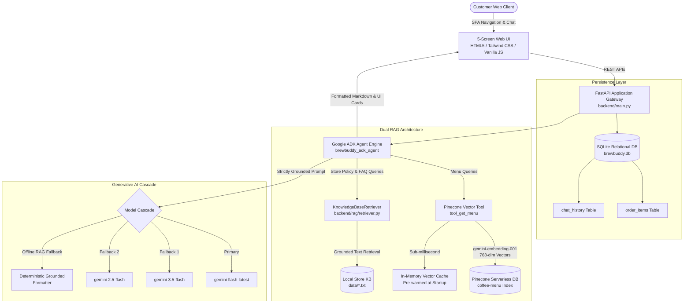

# ☕ BrewBuddy AI

<div align="center">

[](https://python.org)
[](https://fastapi.tiangolo.com)
[](https://github.com/google/agent-development-kit)
[](https://ai.google.dev)
[](https://pinecone.io)
[](LICENSE)

**An intelligent, strictly grounded AI coffee shop assistant built with Google ADK, Gemini, and Pinecone Vector RAG.**

*Developed for Google Cloud Gen AI Academy APAC Cohort 3 (Track 1: Customer-Facing AI Agents)*

</div>

---

## 🌟 Overview

**BrewBuddy AI** is a modern, customer-facing coffee assistant that combines generative AI with vector search and deterministic business logic. It helps customers discover drinks tailored to their tastes, answers store policies accurately, and manages live orders with tax calculation—without hallucinations.

---

## ✨ Key Features

- **🌲 Semantic Menu Search**: Pinecone vector search over menu items using `gemini-embedding-001` (768-dim embeddings).
- **🛡️ Zero Hallucinations**: Strict grounding rules ensure the agent only recommends items currently on the menu.
- **📋 Store Policy & FAQ Hub**: Instant answers for BYO cup discounts (₹15 off), Wi-Fi (`BrewBuddy_Guest`), pet-friendly seating, bulk catering, and refund policies.
- **⚡ Sub-Millisecond Retrieval**: In-memory pre-warmed vector cache and LRU embedding cache for instant responses.
- **📱 5-Screen Modern UI**: Responsive Single Page App (SPA) inspired by Google Stitch Experience Design.
- **🧾 Live Order Cart**: Session-based cart with real-time 5% GST calculation and order tracking.

---

## 🏛️ System Architecture



---

## 🌲 Dual RAG Architecture

```text
                    ┌───────────────────────────┐
                    │    Incoming User Query    │
                    └─────────────┬─────────────┘
                                  │
                  Is query about menu or policies?
                     /                         \
           [Menu / Drink Query]          [Policy / FAQ Query]
                    │                                   │
      ┌─────────────▼─────────────┐       ┌─────────────▼─────────────┐
      │   Pinecone Vector Search  │       │  Knowledge Base Retriever │
      │ 768-dim Cosine Similarity │       │  Intent & Topic Synonyms  │
      │ In-Memory Pre-Warmed Cache│       │ Store Info, FAQs, Hazards │
      └─────────────┬─────────────┘       └─────────────┬─────────────┘
                    │                                   │
                    └─────────────┬─────────────────────┘
                                  │
                    ┌─────────────▼─────────────┐
                    │    Grounded ADK Prompt    │
                    │   Strict Negative Rules   │
                    └─────────────┬─────────────┘
                                  │
                    ┌─────────────▼─────────────┐
                    │  Google Gemini Generator  │
                    │ gemini-flash-latest (0.2) │
                    └───────────────────────────┘
```

---

## 🚀 Quickstart

### 1. Clone & Set Up Environment

```bash
git clone https://github.com/hemu2205/AI-Assistant-for-coffee-shop.git
cd AI-Assistant-for-coffee-shop

# Create virtual environment
python -m venv .venv
.venv\Scripts\activate   # On Linux/macOS: source .venv/bin/activate

# Install dependencies
pip install -r requirements.txt
```

### 2. Configure API Keys

Create a `.env` file in the root directory:

```env
GOOGLE_API_KEY=your_gemini_api_key
PINECONE_API_KEY=your_pinecone_api_key
PORT=8000
HOST=0.0.0.0
```

### 3. Seed Menu Vectors

Populate your Pinecone index with the coffee shop menu:

```bash
python seed.py
```

### 4. Run the Application

```bash
python -m uvicorn backend.main:app --host 0.0.0.0 --port 8000 --reload
```

Open your browser at **[http://localhost:8000](http://localhost:8000)**.

---

## 📱 Application Screens

| Screen | Description |
| :--- | :--- |
| **🤖 AI Assistant** | Conversational chat with embedded product cards and "+ Add to Order" buttons. |
| **☕ Explore Menu** | Visual product catalog with category filters (*Coffee, Cold Coffee, Tea, Bakery*). |
| **🎛️ Preferences** | Customize taste preferences (sweetness, caffeine, milk choice, and dietary tags). |
| **🧾 Order & Receipt** | Live preparation status tracker and itemized receipt with 5% GST tax breakdown. |
| **❓ FAQ & Policies** | Store policy cards with one-click *"Ask AI Assistant"* chips. |

---

## 🔌 API Endpoints

| Method | Endpoint | Description |
| :--- | :--- | :--- |
| `POST` | `/api/chat` | Send a message to the AI Barista agent |
| `GET` | `/api/menu` | Retrieve all menu products |
| `POST` | `/api/recommend` | Get personalized drink recommendations |
| `GET` | `/api/order` | View current shopping cart and tax breakdown |
| `POST` | `/api/order` | Add a product to the cart |
| `DELETE`| `/api/order` | Clear the current order |
| `GET` | `/api/chat/history` | Get session conversation history |
| `GET` | `/api/health` | Service health status |

---

## 📂 Project Structure

```text
├── api/
│   └── index.py                  # Vercel serverless entrypoint
├── backend/
│   ├── agent/
│   │   ├── agent.py              # Google ADK agent & grounding logic
│   │   └── tools.py              # ADK tool definitions (Pinecone menu search & orders)
│   ├── models/
│   │   └── schemas.py            # Pydantic v2 schemas for requests & responses
│   ├── rag/
│   │   ├── pinecone_client.py    # Pinecone singleton & warm vector cache
│   │   └── retriever.py          # Store knowledge & policy retriever
│   ├── services/
│   │   ├── db.py                 # SQLite database & chat history manager
│   │   ├── order_service.py      # Cart operations & 5% GST tax calculator
│   │   └── recommendation.py     # Deterministic customer preference matching
│   └── main.py                   # FastAPI server & static file host
├── data/
│   ├── menu.json                 # Canonical menu items (Source of Truth)
│   ├── menu.txt                  # Text summary of menu items
│   ├── store_info.txt            # Hours, location & store policy guide
│   ├── faq.txt                   # BYO Cup, Wi-Fi, and catering FAQs
│   └── allergens.txt             # Ingredient & allergen cross-contamination info
├── frontend/
│   ├── index.html                # 5-Screen SPA Tailwind layout
│   ├── app.js                    # Client state router & chat UI
│   └── styles.css                # Custom theme variables & styling
├── tests/
│   └── test_backend.py           # Automated test suite
├── .dockerignore                 # Docker build ignore rules
├── .env.example                  # Environment variable template
├── .gitignore                    # Git version control ignore rules
├── brewbuddy.db                  # Local SQLite database (cart items & chat logs)
├── Dockerfile                    # Container configuration for Google Cloud Run
├── requirements.txt              # Python project dependencies
├── seed.py                       # Pinecone index vector seeding script
├── vercel.json                   # Vercel deployment configuration
└── README.md                     # Project documentation
```

---

## 🛠️ Tech Stack

- **Backend**: FastAPI, Python 3.11, SQLite
- **Agent Framework**: Google Agent Development Kit (`google-adk` v2.8.0)
- **LLM & Embeddings**: Google Gemini Flash (`gemini-flash-latest`), `gemini-embedding-001`
- **Vector Database**: Pinecone Serverless (`coffee-menu` index)
- **Frontend**: HTML5, Tailwind CSS, Vanilla JavaScript, Marked.js

---

## 📜 License

This project is licensed under the [MIT License](LICENSE).
