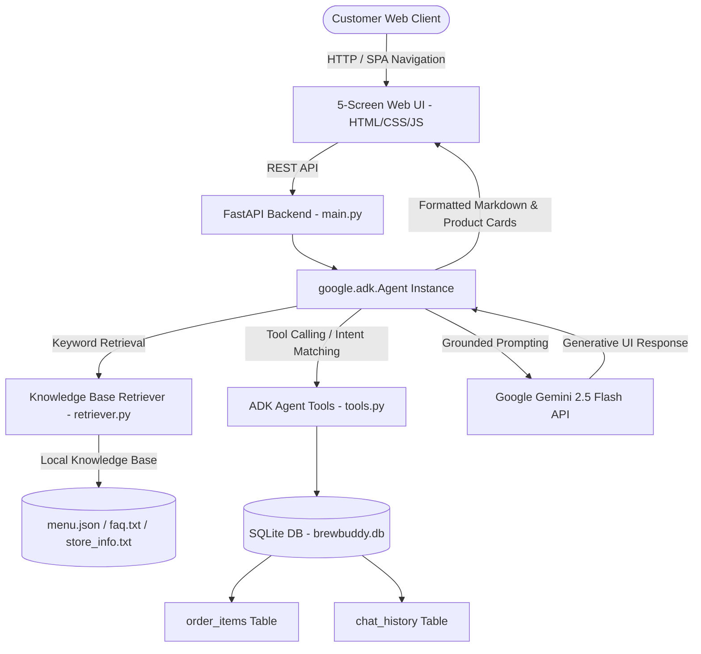

# ☕ BrewBuddy AI — Personalized Coffee Shop Assistant

> **"Your personal coffee expert."**
> 
> *Developed for Google Gen AI Academy APAC Cohort 3 Track 1*

BrewBuddy AI is a production-grade, full-stack AI coffee assistant application powered by the **Google Agent Development Kit (`google-adk` v2.8.0)**, **Gemini 2.5 Flash**, **Local Retrieval-Augmented Generation (RAG)**, and an interactive **5-Screen Single Page Application (SPA)** built to match Google Stitch Experience Design.

---

## 🏛️ System Architecture



---

## 🌟 Core Project Features

### 1. 🤖 Official Google Agent Development Kit (`google-adk` v2.8.0)
- Built with `google.adk.Agent` and tool calling function declarations (`tool_get_menu`, `tool_recommend_products`, `tool_check_allergens`, `tool_get_store_information`).
- Runs Gemini 2.5 Flash conversational loops with local RAG context grounding.

### 2. 📱 5-Screen SPA Experience (Google Stitch Design)
- **🤖 AI Assistant Chat (`#page-assistant`)**: Conversational interface featuring embedded Generative UI product cards, live cart sidebar, and markdown formatting.
- **☕ Explore Menu Grid (`#page-menu`)**: Full scrolling gallery for all 15 coffee and bakery items with category filters (`Coffee`, `Cold Coffee`, `Tea`, `Snacks`) and real-time search.
- **🎛️ Personalization Studio (`#page-preferences`)**: Taste configurator for temperature (`Cold`, `Hot`), caffeine strength (`High`, `Medium`, `Low`), dietary preferences (`Vegan`, `Vegetarian`, `Keto`), and sweetness levels.
- **🧾 Order Status & Invoice (`#page-orders`)**: Real-time order preparation tracking progress bar and itemized receipt breakdown with 5% GST tax calculations.
- **❓ FAQ & Store Policies (`#page-faq`)**: Dedicated card hub for BYO Cup discounts (₹15 off), Wi-Fi credentials (`BrewBuddy_Guest`), refund policies, pet guidelines, and catering.

### 3. 🎨 Unified Generative UI Cards
- Combines high-resolution product photography, price tags, calorie badges (`270 kcal`), caffeine levels (`Medium`), allergen warnings (`gluten, dairy`), and instant **"+ Add to Order"** buttons directly inside the AI chat response bubble.

### 4. 🔍 Smart RAG & Intent Handler
- Stop-word filtered keyword retrieval (`retriever.py`) over local store policies, Wi-Fi guides, allergen lists, and menu items.
- Intent detection for recommendations (*"give me the best coffee"*) and direct product inquiries (*"Tell me more about Chocolate Muffin"*).

### 5. 💾 Persistent Chat History
- Stores user messages and AI responses in SQLite (`chat_history` table), preserving multi-turn chat history across page reloads.

---

## 📂 Project Directory Structure

```text
Coffe agent/
├── backend/
│   ├── agent/
│   │   ├── agent.py          # google.adk.Agent & execution pipeline
│   │   └── tools.py          # ADK function tools
│   ├── models/
│   │   └── schemas.py        # Pydantic v2 schemas
│   ├── rag/
│   │   └── retriever.py      # Stop-word filtered keyword RAG
│   ├── services/
│   │   ├── db.py             # SQLite database manager & chat_history
│   │   ├── order_service.py  # Shopping cart & 5% GST tax calculator
│   │   └── recommendation.py # Preference matching algorithm
│   └── main.py               # FastAPI application & static server
├── data/
│   ├── menu.json             # 15 drinks & bakery items with Stitch images
│   ├── store_info.txt        # Store hours & location guide
│   ├── faq.txt               # BYO Cup, Wi-Fi, Catering & Refund policies
│   └── allergens.txt         # Allergen cross-contamination warnings
├── frontend/
│   ├── index.html            # 5-Screen SPA Tailwind markup
│   ├── app.js                # SPA router, Marked.js, and API client
│   └── styles.css            # Custom coffee theme styling
├── tests/
│   └── test_backend.py       # Pytest backend automated test suite
├── brewbuddy.db              # SQLite database (auto-seeded)
├── requirements.txt          # Python dependencies
└── README.md                 # Project documentation
```

---

## 💻 Local Execution Guide

### 1. Setup Virtual Environment
```powershell
python -m venv .venv
.venv\Scripts\Activate.ps1
```

### 2. Install Dependencies
```powershell
pip install -r requirements.txt
```

### 3. Start Local Server
```powershell
python -m uvicorn backend.main:app --host 0.0.0.0 --port 8000
```

Access the application in your browser:
👉 **[http://localhost:8000](http://localhost:8000)**

---

## 📜 License & Acknowledgments

- **License**: MIT License
- **Track**: Google Gen AI Academy APAC Cohort 3 (Track 1)
- **Design Reference**: Stitch Experience Design ID `3306724857720669864`
