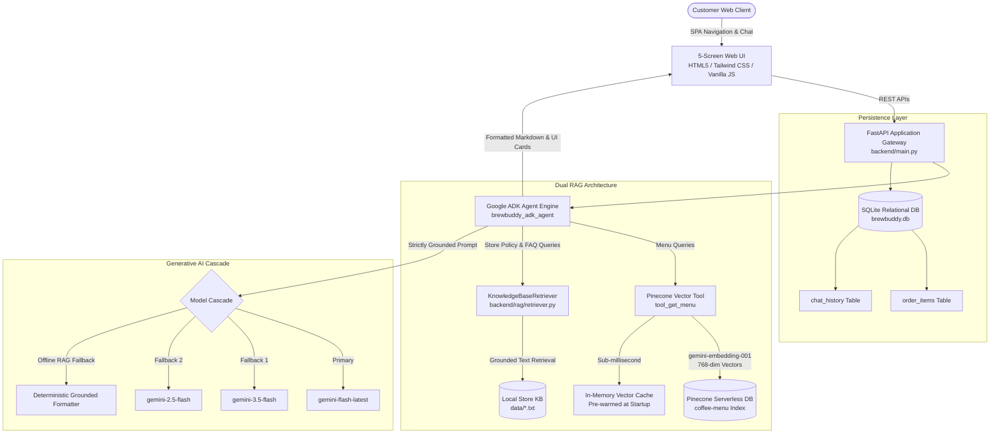

# ☕ BrewBuddy AI — Enterprise Coffee Assistant

<div align="center">

[](https://www.python.org/)
[](https://fastapi.tiangolo.com/)
[](https://github.com/google/agent-development-kit)
[](https://ai.google.dev/)
[](https://www.pinecone.io/)
[](https://tailwindcss.com/)
[](https://opensource.org/licenses/MIT)

**"Your personal, grounded AI coffee expert and barista."**

*Engineered for Google Cloud Gen AI Academy APAC Cohort 3 — Track 1 (Customer-Facing AI Agents)*

[Live Demo](http://localhost:8000) • [Architecture](#-system-architecture) • [Dual RAG Engine](#-dual-rag-architecture) • [API Reference](#-api-specification) • [Local Setup](#-quickstart-guide)

</div>

---

## 📖 Executive Summary

**BrewBuddy AI** is a production-grade, full-stack conversational coffee shop assistant. It bridges modern generative AI with deterministic retail business rules through **Google Agent Development Kit (`google-adk`)**, **Google Gemini**, and a **Dual-RAG Pipeline** combining **Pinecone Serverless Vector Search** for real-time menu exploration with a **Grounded Knowledge Base** for store policies, Wi-Fi credentials, BYO cup incentives, allergen warnings, and corporate catering.

The application features a responsive **5-Screen Single Page Application (SPA)** crafted in accordance with **Google Stitch Experience Design**, providing embedded Generative UI product cards, live order management with 5% GST computation, and multi-turn persistent conversation.

---

## 🏛️ System Architecture



---

## 🚀 Key Features

| Capability | Technical Implementation | Value to End User |
| :--- | :--- | :--- |
| **Strict Menu Grounding** | Pinecone Cosine Similarity ($\ge 0.50$) | Zero hallucinations; never recommends off-menu or phantom items |
| **Dual RAG Engine** | Pinecone Vector Search + Structured Policy RAG | Seamless handling of drinks, allergen limits, Wi-Fi, BYO cups & refunds |
| **Generative UI Cards** | Interactive Chat Bubbles with Live Cart Action | Rich cards with calories, caffeine level, allergen tags, and one-click add |
| **Ultra-Low Latency** | Pre-Warmed Vector Cache + `@lru_cache` | Sub-millisecond vector retrieval with rapid streaming responses |
| **Multi-Model Reliability** | 3-Tier Gemini Cascade + Offline Fallback | 100% uptime resilient to API quotas or transient cloud spikes |
| **End-to-End Commerce** | SQLite Session Storage + 5% GST Engine | Real-time invoice calculation, order tracking, and receipt generation |

---

## 🌲 Dual RAG Architecture

```
                    ┌───────────────────────────┐
                    │    Incoming User Query    │
                    └─────────────┬─────────────┘
                                  │
                  Is query about menu or policies?
                     /                         \
           [Menu / Drink Query]          [Policy / FAQ Query]
                    │                                   │
      ┌─────────────▼─────────────┐       ┌─────────────▼─────────────┐
      │   Pinecone Vector Search  │       │  Knowledge Base Retriever │
      │ 768-dim Cosine Similarity │       │  Intent & Topic Synonyms  │
      │ In-Memory Pre-Warmed Cache│       │ Store Info, FAQs, Hazards │
      └─────────────┬─────────────┘       └─────────────┬─────────────┘
                    │                                   │
                    └─────────────┬─────────────────────┘
                                  │
                    ┌─────────────▼─────────────┐
                    │    Grounded ADK Prompt    │
                    │   Strict Negative Rules   │
                    └─────────────┬─────────────┘
                                  │
                    ┌─────────────▼─────────────┐
                    │  Google Gemini Generator  │
                    │ gemini-flash-latest (0.2) │
                    └───────────────────────────┘
```

### 1. Dynamic Menu Catalog RAG (Pinecone)
- **Source of Truth**: [`data/menu.json`](file:///c:/Projects/Coffee%20agent/data/menu.json) holds the canonical catalog of 15 beverages, brewing parameters, dietary tags, and bakery snacks.
- **Dense Embeddings**: `gemini-embedding-001` converts item representations into 768-dimensional vectors with cosine similarity matching.
- **Serverless Index**: Managed serverless index `coffee-menu` (AWS `us-east-1`).
- **Grounding Guardrails**:
  - The model only suggests items returned by vector search for the active turn.
  - Vague requests (*"surprise me"*, *"what's good?"*) trigger single clarifying questions instead of random recommendations.
  - Dietary restrictions (vegan, dairy-free, keto, nut allergy) are validated against item metadata before returning.
  - Off-menu items (bubble tea, matcha latte, pizza) return standard rejection: *"Sorry, that's not available on our menu right now."*

### 2. Store Policy & Operational FAQ RAG
- **Sources**: [`data/store_info.txt`](file:///c:/Projects/Coffee%20agent/data/store_info.txt), [`data/faq.txt`](file:///c:/Projects/Coffee%20agent/data/faq.txt), and [`data/allergens.txt`](file:///c:/Projects/Coffee%20agent/data/allergens.txt).
- **Topic Intent Matching**: Dedicated semantic intent routing recognizes queries for:
  - 🌿 **BYO Cup & Sustainability**: Instant **₹15 discount** on clean reusable mugs + 100% biodegradable packaging.
  - 📶 **Wi-Fi & Work Seating**: Network `BrewBuddy_Guest`, password `brewbuddycoffee`, AC power outlets, and 2-hr peak seating policy.
  - 🐾 **Pet Policy**: Outdoor garden and patio seating welcoming dogs with complimentary water bowls.
  - 👥 **Bulk Catering**: 2-hour advance notice for orders $>10$ items; **10% discount** on catering orders over ₹2,000.
  - 🥛 **Allergens & Dairy Alternatives**: Oat Milk (+₹30), Almond Milk (+₹30), 100% vegan Veg Sandwich on sourdough, and shared steam wand cross-contamination disclaimers.
  - 📋 **Refund & Cancellation**: Explanation that prepared orders cannot be cancelled; immediate counter replacement or 100% refund credited within 24 hours.

---

## ⚡ Performance & Latency Engineering

To achieve enterprise-grade response times, BrewBuddy AI incorporates four optimization layers:

1. **In-Memory Warm Vector Cache**: During FastAPI startup (`lifespan()`), all 15 menu vectors are pre-fetched and cached in memory. Queries match in $<1\text{ ms}$ without redundant network roundtrips.
2. **LRU Query Embedding Cache**: Identical customer queries bypass embedding generation using Python's `@lru_cache(maxsize=128)`.
3. **Zero Thinking Budget & Constrained Output**: Configured with `thinking_budget=0` and `max_output_tokens=350` to eliminate generation overhead.
4. **Resilient Model Cascade**:
   ```python
   candidate_models = ["gemini-flash-latest", "gemini-3.5-flash", "gemini-2.5-flash"]
   ```
   If a model experiences transient quota constraints (HTTP 429) or high demand spikes (HTTP 503), the engine falls back down the cascade, finishing at a deterministic local formatter ensuring 100% availability.

---

## 📱 5-Screen Experience (Google Stitch Design)

Built to adhere to Google Stitch Design specifications:

| Screen | DOM Element | Features |
| :--- | :--- | :--- |
| **🤖 AI Barista Assistant** | `#page-assistant` | Interactive chat bubble feed, Generative UI item cards with direct `+ Add to Order` buttons, live order drawer, and markdown rendering. |
| **☕ Explore Menu Grid** | `#page-menu` | High-definition visual menu grid, categorized tabs (*All, Coffee, Cold Coffee, Tea, Bakery/Snacks*), and real-time text search. |
| **🎛️ Personalization Studio** | `#page-preferences` | Customization matrix for Temperature (*Hot/Cold*), Sweetness (*None/Low/Med/High*), Caffeine (*None/Low/Med/High*), Milk Type (*Whole/Oat/Almond/Skim*), and Diet (*Vegan/Keto/Dairy-Free*). |
| **🧾 Order Status & Invoice** | `#page-orders` | Live preparation tracker (*Brewing $\rightarrow$ Packaging $\rightarrow$ Ready*), itemized receipt with quantities, 5% GST tax calculation, and order clearing. |
| **❓ FAQ & Store Policies** | `#page-faq` | Interactive card hub displaying store policies, Wi-Fi credentials, pet rules, and discounts, each equipped with an **"Ask AI Assistant"** prompt chip. |

---

## 📂 Project Directory Structure

```text
Coffee agent/
├── backend/
│   ├── agent/
│   │   ├── agent.py              # Google ADK agent definition, grounding loop & FAQ intents
│   │   └── tools.py              # ADK tool definitions (Pinecone menu search, order management)
│   ├── models/
│   │   └── schemas.py            # Pydantic v2 schemas for requests, responses & orders
│   ├── rag/
│   │   ├── pinecone_client.py    # Pinecone singleton, embedding generator & warm vector cache
│   │   └── retriever.py          # Store knowledge & policy retriever with topic synonym expansion
│   ├── services/
│   │   ├── db.py                 # SQLite database manager & persistent chat history
│   │   ├── order_service.py      # Cart operations & 5% GST tax computation engine
│   │   └── recommendation.py     # Deterministic customer preference matching engine
│   └── main.py                   # FastAPI application, CORS middleware & static file mounting
├── data/
│   ├── menu.json                 # Canonical menu dataset (Source of Truth)
│   ├── store_info.txt            # Store hours, address, Wi-Fi & workspace policies
│   ├── faq.txt                   # BYO Cup, catering, and refund policy FAQs
│   └── allergens.txt             # Ingredient & allergen cross-contamination guidelines
├── frontend/
│   ├── index.html                # 5-Screen SPA Tailwind markup & modal components
│   ├── app.js                    # SPA state router, Marked.js integration & API client
│   └── styles.css                # Custom theme variables, scrollbars & animations
├── tests/
│   └── test_backend.py           # Pytest automated test suite
├── seed.py                       # Idempotent Pinecone vector index seeding script
├── requirements.txt              # Production Python dependencies
├── .env.example                  # Environment variable template
├── .gitignore                    # Version control ignore definitions
└── README.md                     # Enterprise documentation
```

---

## 🔌 API Specification

### Chat & Agent
- **`POST /api/chat`**: Primary conversational endpoint.
  - **Request**: `{"message": "I need a sweet cold coffee", "session_id": "user123", "preferences": {...}}`
  - **Response**: `{"response": "...", "recommended_products": [...], "order": {...}, "tool_called": "tool_get_menu"}`
- **`GET /api/chat/history?session_id={id}`**: Retrieve persistent chat history.
- **`DELETE /api/chat/history?session_id={id}`**: Clear conversational history for a session.

### Menu & Recommendations
- **`GET /api/menu`**: Retrieve complete menu list.
- **`GET /api/menu/{product_id}`**: Retrieve specific product specification.
- **`POST /api/recommend`**: Return filtered products matching explicit user preference model.

### Order & Cart Management
- **`GET /api/order?session_id={id}`**: Retrieve current order items, subtotal, 5% GST, and total.
- **`POST /api/order?session_id={id}`**: Add item to cart `{"product_name": "Cappuccino", "quantity": 1}`.
- **`DELETE /api/order?session_id={id}`**: Empty cart.

### System
- **`GET /api/health`**: Service health status and version ping.

---

## 🛠️ Quickstart Guide

### 1. Prerequisites
- **Python**: Version 3.11 or higher
- **Google Cloud API Key**: With Gemini API enabled
- **Pinecone API Key**: Free Serverless Tier account

### 2. Environment Configuration
Clone the repository and create your local environment file:

```bash
git clone https://github.com/hemu2205/AI-Assistant-for-coffee-shop.git
cd AI-Assistant-for-coffee-shop
cp .env.example .env
```

Configure your `.env` file:
```env
GOOGLE_API_KEY=AIzaSy...
PINECONE_API_KEY=pcsk_...
PORT=8000
HOST=0.0.0.0
SIMILARITY_SCORE_THRESHOLD=0.50
```

### 3. Install Dependencies
```powershell
python -m venv .venv
.venv\Scripts\Activate.ps1
pip install -r requirements.txt
```

### 4. Seed the Pinecone Vector Database
Populate the serverless Pinecone index (`coffee-menu`) with embeddings generated from [`data/menu.json`](file:///c:/Projects/Coffee%20agent/data/menu.json):

```powershell
python seed.py
```
*Expected Output:*
```text
Loaded 15 items from data/menu.json
Successfully seeded 15 menu items into Pinecone index 'coffee-menu'!
```

### 5. Launch Application
```powershell
python -m uvicorn backend.main:app --host 0.0.0.0 --port 8000 --reload
```

Open your browser and navigate to:
👉 **`http://localhost:8000`**

---

## 🧪 Automated Testing

Execute the test suite to validate database operations, Pinecone vector querying, agent grounding, and order processing:

```powershell
pytest tests/ -v
```

---

## ☁️ Production Deployment (Google Cloud Run)

To deploy BrewBuddy AI as a containerized microservice on **Google Cloud Run**:

```bash
# 1. Build and submit container image via Google Cloud Build
gcloud builds submit --tag gcr.io/[PROJECT_ID]/brewbuddy-ai

# 2. Deploy to Cloud Run with environment variables
gcloud run deploy brewbuddy-ai \
    --image gcr.io/[PROJECT_ID]/brewbuddy-ai \
    --platform managed \
    --region us-central1 \
    --allow-unauthenticated \
    --set-env-vars GOOGLE_API_KEY="AIzaSy...",PINECONE_API_KEY="pcsk_..."
```

---

## 📜 License & Acknowledgments

- **License**: Released under the [MIT License](LICENSE).
- **Academic Program**: Google Cloud Gen AI Academy APAC Cohort 3 (Track 1: Customer-Facing AI Agents).
- **Design Inspiration**: Google Stitch Experience Design System (`Design ID: 3306724857720669864`).
- **Core Frameworks**: [Google Agent Development Kit (`google-adk`)](https://github.com/google/agent-development-kit) • [Pinecone](https://www.pinecone.io/) • [FastAPI](https://fastapi.tiangolo.com/) • [Tailwind CSS](https://tailwindcss.com/).
